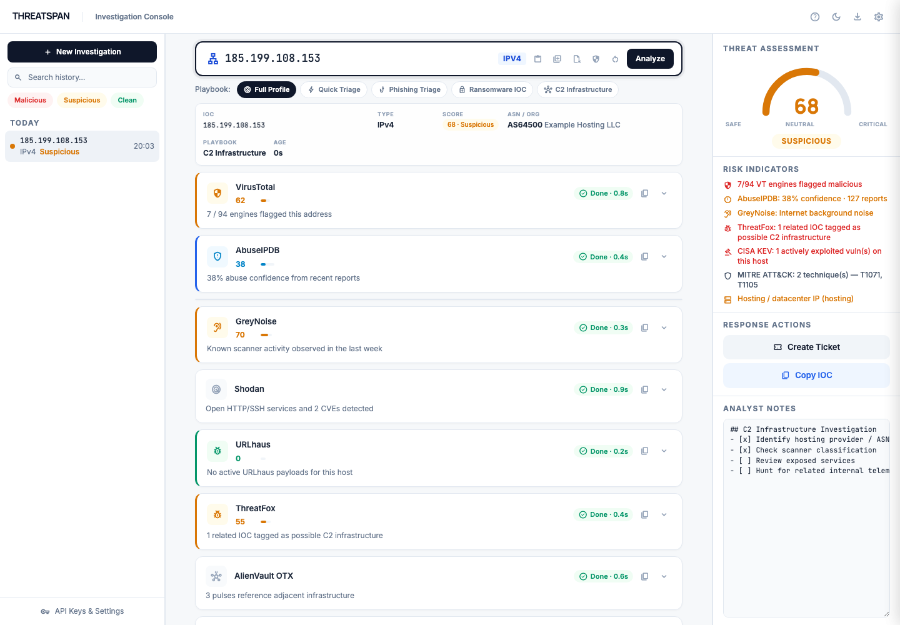
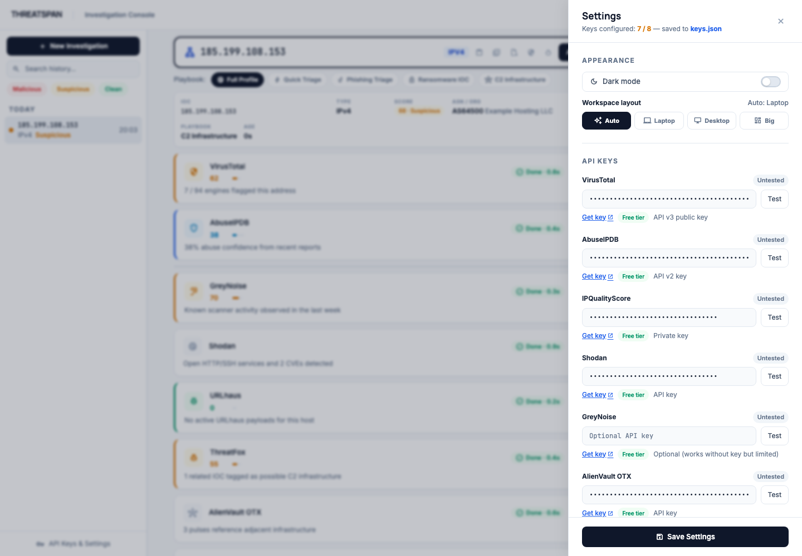
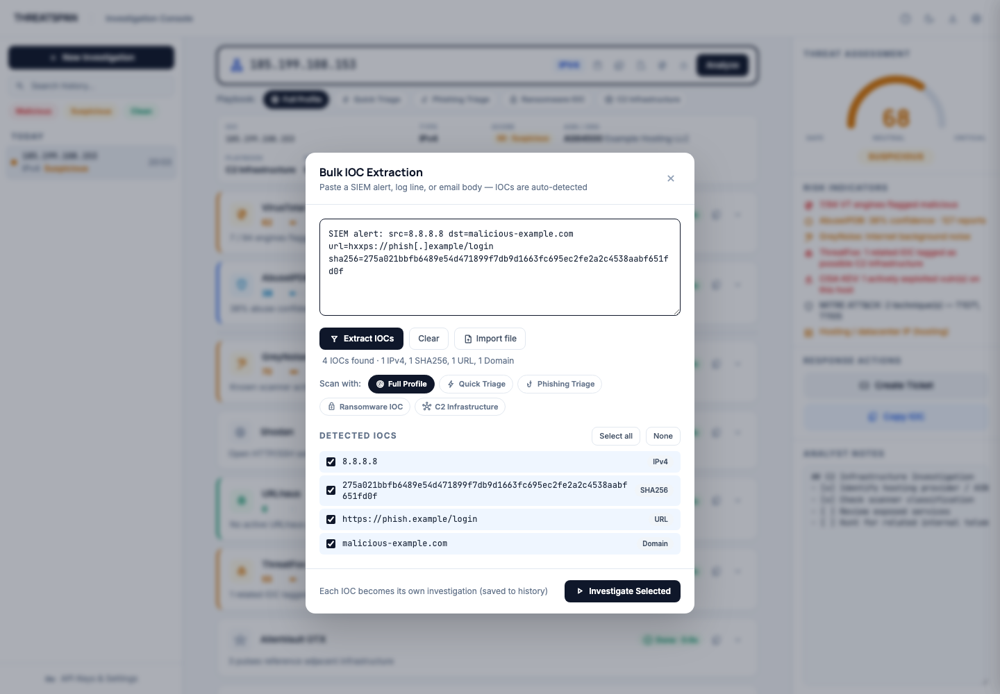

# ThreatSpan

**ThreatSpan is a local-first investigation console for SOC analysts, incident responders, and home-lab defenders.**

Paste an IP address, domain, URL, or file hash and ThreatSpan fans out to reputation, infrastructure, malware, vulnerability, and framework-mapping sources in one keyboard-first workspace.



## Why ThreatSpan

ThreatSpan exists for the moment when an alert lands and you need context fast. Instead of bouncing between VirusTotal, AbuseIPDB, Shodan, GreyNoise, urlscan.io, OTX, abuse.ch, DNS, WHOIS, CISA KEV, NVD, and notes, you get one investigation surface:

- **14 enrichment modules** across reputation, malware intel, infrastructure, DNS, WHOIS, urlscan screenshots, CISA KEV, NVD, and MITRE ATT&CK.
- **Live risk scoring** with Clean, Likely Clean, Suspicious, and Malicious verdicts.
- **Scenario playbooks** for quick triage, phishing, ransomware IOCs, and C2 infrastructure.
- **Bulk IOC extraction** from alerts, logs, emails, CSV, text, and STIX-like payloads.
- **Analyst-ready exports** for tickets, wikis, STIX 2.1, MISP, ATT&CK Navigator, NIST CSF 2.0, JSON, CSV, and plain text.
- **Local-first privacy**: no account, no telemetry, no cloud backend.

ThreatSpan runs on your machine. API calls only go to the providers you configure.

## Install

**Supported platforms:** macOS, Linux, and Windows. The macOS auto-start command is macOS-only.

ThreatSpan requires **Node.js 14 or newer**. There are no runtime npm dependencies.

### Run with npx

```bash
npx threatspan
```

### Install globally

```bash
npm install -g threatspan
threatspan
```

### Run from source

```bash
git clone https://github.com/djason1337/threatspan.git
cd threatspan
./threatspan
```

Open the console at:

```text
http://localhost:3000
```

### Single-file binaries

GitHub releases include standalone binaries for macOS, Linux, and Windows. These do not require a separate Node.js install.

## First Investigation

1. Start ThreatSpan.
2. Open **Settings** and add whichever API keys you have.
3. Paste an IOC into the investigation bar.
4. Pick a playbook or keep **Full Profile** selected.
5. Press **Enter**.
6. Expand any module card for full structured details.
7. Export the case into the format your workflow needs.

ThreatSpan supports IPv4, IPv6, domains, URLs, MD5, SHA1, and SHA256.



## API Keys

Some modules require API keys. Others work immediately.

| Provider | Used for | Key required |
| --- | --- | --- |
| VirusTotal | Reputation, URL/file/IP scans, AV consensus | Yes |
| AbuseIPDB | IP abuse confidence and reports | Yes |
| IPQualityScore | Fraud, proxy, VPN, Tor, bot, URL risk | Yes |
| Shodan | Open ports, services, banners, CVEs | Yes |
| GreyNoise | Internet scanner classification | Optional |
| AlienVault OTX | Pulses, related IOCs, MITRE ATT&CK tags | Yes |
| abuse.ch | URLhaus, ThreatFox, MalwareBazaar | Yes |
| urlscan.io | URL/domain screenshots and scan details | Yes |
| GeoIP / ASN | Location and network ownership via ipwho.is | No |
| DNS | Cloudflare DNS-over-HTTPS lookups | No |
| WHOIS / RDAP | Registration and network ownership | No |
| Sucuri SiteCheck | Website blacklist and malware checks | No |
| CISA KEV | Known exploited CVE cross-reference | No |
| NIST NVD | CVSS, severity, and CVE summaries | No |

Keys are encrypted at rest under `~/.threatspan/`. See [SECURITY.md](SECURITY.md) for the local security model.

## Playbooks

ThreatSpan playbooks reduce noise and API usage by matching the investigation to the threat scenario.

| Playbook | Best for | What it emphasizes |
| --- | --- | --- |
| Full Profile | Deep investigation | Every applicable module |
| Quick Triage | Fast alert validation | Reputation-only sweep |
| Phishing Triage | URLs and suspicious domains | urlscan, WHOIS age, DNS, website checks |
| Ransomware IOC | Hashes, samples, C2, IR handoff | MalwareBazaar, ThreatFox, OTX, VT, response checklist |
| C2 Infrastructure | External IPs and domains | Shodan, GreyNoise, WHOIS, DNS, related intel |

## Bulk IOC Extraction

Paste a SIEM alert, EDR event, email body, proxy log, CSV, plain text file, or STIX-like payload. ThreatSpan extracts supported IOCs, refangs defanged indicators, lets you select what matters, and creates one investigation per IOC.



## Exports

ThreatSpan can export:

- Plain text reports
- Markdown reports
- JSON case data
- STIX 2.1 bundles
- MISP event JSON
- MITRE ATT&CK Navigator layers
- NIST CSF 2.0 reports
- CSV history
- Share links and case JSON for handoff

## Command Line

```text
threatspan [options]
threatspan <subcommand>

Options:
  --port <n>     Port to listen on (default: 3000, env PORT)
  --no-open      Do not auto-open the browser
  --version, -v  Show version
  --help, -h     Show help

Subcommands:
  install-launchd [--port <n>]   macOS: auto-start at login
  uninstall-launchd              macOS: remove the LaunchAgent
```

Examples:

```bash
threatspan --port 8080
threatspan --no-open
PORT=9000 threatspan
```

## macOS Auto-Start

```bash
threatspan install-launchd
threatspan install-launchd --port 8080
```

Remove it with:

```bash
threatspan uninstall-launchd
```

## Privacy and Security

- ThreatSpan listens only on `127.0.0.1`.
- There is no cloud backend, telemetry, analytics, or account system.
- API keys are encrypted with AES-256-GCM and stored under `~/.threatspan/`.
- The local proxy allows only explicit security-provider hosts.
- Same-origin checks, loopback host validation, session-token auth, SSRF defense, request timeouts, and per-host rate limits are built into `server.js`.

Read the full model in [SECURITY.md](SECURITY.md).

## Documentation

- [User Guide](docs/USER_GUIDE.md)
- [Security Model](SECURITY.md)

## Contributing

ThreatSpan is intentionally small: the core app is `threatspan.html` plus `server.js`.

To add a module:

1. Add an entry to `MODULE_DEFS` in `threatspan.html`.
2. Write a `query<Name>(ioc, type, signal)` function.
3. Add a display case to `buildModuleBody`.
4. Wire the runner into `startInvestigation`.
5. Add the upstream host to the proxy allowlist in `server.js`.

Issues and PRs are welcome.

## License

MIT. See [LICENSE](LICENSE).
